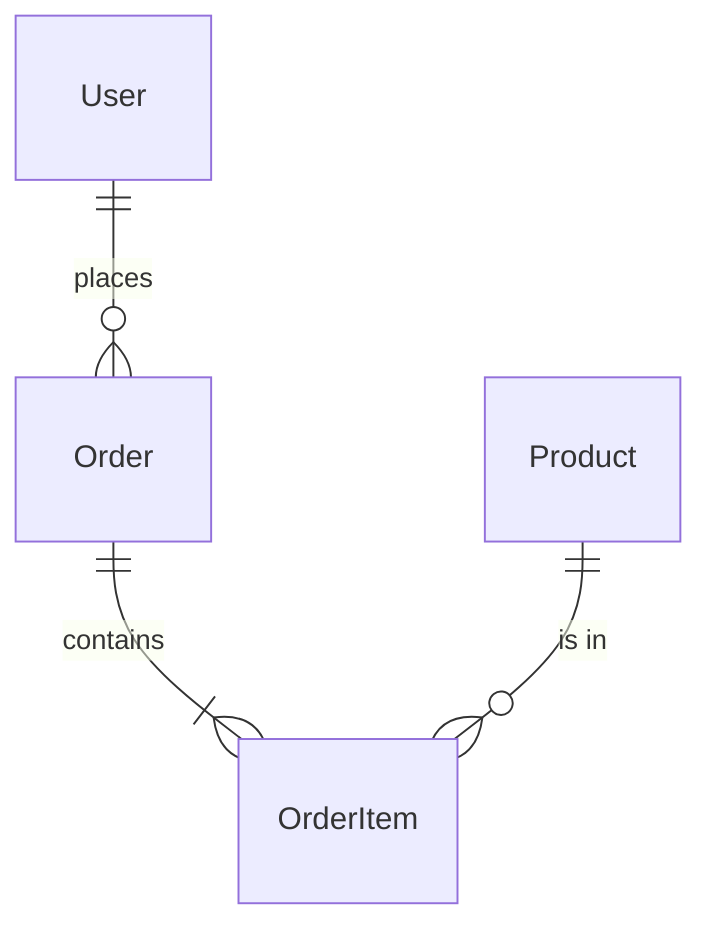
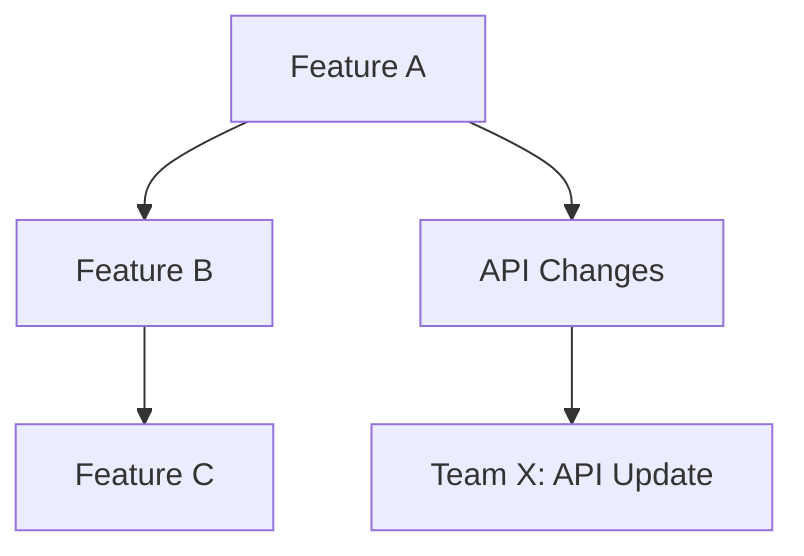

# Part IV: Workflow Recipes

[ Back to Guide](../ReadMe.md) | [ Part III](part-3-putting-it-together.md)

---

## Workflow Recipes

This section provides comprehensive, copy-paste-ready recipes for common enterprise workflows. Each recipe shows which primitives to combine and includes complete implementation examples.

### Overview: Combining Primitives for Real Workflows

Most real-world workflows combine multiple primitives:

| Recipe Type | Primitives Used |
|-------------|-----------------|
| Issue Tracking | MCP (API access) + Skill (templates/conventions) + Prompt (user invocation) |
| Deployments | Agent (persona) + Prompt (checklist) + MCP (execution) |
| Code Review | Agent (reviewer persona) + Instructions (standards) |
| Documentation | Prompt (generator) + Instructions (style guide) |

---

### Issue Tracking & Ticket Management

#### GitHub Issues Workflow

**Goal:** Create well-formatted GitHub issues with templates and automatic labeling

**Primitives Used:**
- MCP Server: `@modelcontextprotocol/server-github`
- Skill: `github-issues/` with templates
- Prompt: `/create-issue.prompt.md`

**MCP Configuration (.vscode/mcp.json):**
```json
{
  "servers": {
    "github": {
      "command": "npx",
      "args": ["@modelcontextprotocol/server-github"],
      "env": {
        "GITHUB_PERSONAL_ACCESS_TOKEN": "${env:GITHUB_TOKEN}"
      }
    }
  }
}
```

**Skill (.github/skills/github-issues/SKILL.md):**
``````markdown
---
name: github-issues
description: Create and manage GitHub issues with team templates. Use when user wants to file a bug, request a feature, or create any GitHub issue.
---

# GitHub Issue Creation

## Bug Report Template
- Title: [BUG] Short description
- Labels: bug, needs-triage
- Required sections: Steps to Reproduce, Expected vs Actual, Environment

## Feature Request Template
- Title: [FEATURE] Short description
- Labels: enhancement, needs-discussion
- Required sections: Problem Statement, Proposed Solution, Alternatives

## Task Template
- Title: [TASK] Short description
- Labels: task
- Required sections: Description, Acceptance Criteria, Dependencies
``````

**Prompt (.github/prompts/create-issue.prompt.md):**
```markdown
---
agent: 'agent'
description: 'Create a GitHub issue with proper template'
model: 'Claude Sonnet 4'
---

Create a GitHub issue for this repository:

**Issue Type:** {{issueType}} (bug/feature/task)
**Summary:** {{summary}}

1. Use the appropriate template from the github-issues skill
2. Apply correct labels based on issue type
3. Fill in all required sections
4. Assign to the appropriate team if specified
5. Link to related issues if mentioned
```

#### Jira Integration Workflow

**Goal:** Create Jira tickets with proper fields, link to PRs, and track progress

**Primitives Used:**
- MCP Server: Jira MCP server
- Skill: `jira-workflows/` with issue type definitions
- Agent: Product owner persona for acceptance criteria

**Skill (.github/skills/jira-workflows/SKILL.md):**
``````markdown
---
name: jira-workflows
description: Create and manage Jira issues following team conventions. Use when user mentions Jira, tickets, stories, epics, or sprint work.
---

# Jira Issue Management

## Issue Types
| Type | Use For | Required Fields |
|------|---------|-----------------|
| Story | User-facing features | Acceptance Criteria, Story Points, Sprint |
| Bug | Defects | Steps to Reproduce, Severity, Environment |
| Task | Technical work | Description, Estimate |
| Epic | Large initiatives | Business Value, Target Release |
| Spike | Research/investigation | Time Box, Questions to Answer |

## Acceptance Criteria Format
Use Given/When/Then format:
```
Given [precondition]
When [action]
Then [expected result]
```

## Linking Conventions
- Blocks/is blocked by: Technical dependencies
- Relates to: Same feature area
- Is caused by/causes: Bug relationships
``````

**Prompt (.github/prompts/create-jira-ticket.prompt.md):**
```markdown
---
agent: 'agent'
description: 'Create a Jira ticket with all required fields'
model: 'Claude Sonnet 4'
---

Create a Jira {{issueType}} ticket:

**Title:** {{title}}
**Description:** {{description}}

Follow the jira-workflows skill conventions:
1. Use the correct issue type template
2. Add appropriate labels and components
3. Write acceptance criteria in Given/When/Then format
4. Estimate story points using Fibonacci (1, 2, 3, 5, 8, 13)
5. Link to related tickets if mentioned
6. Set priority based on business impact
```

#### Azure DevOps Work Items Workflow

**Goal:** Create and manage Azure DevOps work items with proper hierarchy

**Primitives Used:**
- MCP Server: Azure DevOps MCP server
- Skill: `azure-devops-workflows/` with work item templates
- Prompt: `/create-work-item.prompt.md`

**Skill (.github/skills/azure-devops-workflows/SKILL.md):**
```markdown
---
name: azure-devops-workflows
description: Create and manage Azure DevOps work items. Use when user mentions Azure DevOps, work items, user stories, tasks, bugs, or sprints.
---

# Azure DevOps Work Item Management

## Work Item Types
- **Epic** — Large feature spanning multiple sprints
- **Feature** — Deliverable piece of functionality
- **User Story** — User-facing requirement
- **Task** — Developer work item
- **Bug** — Defect requiring fix

## Hierarchy
Epic → Feature → User Story → Task

## Required Fields by Type
### User Story
- Title: As a [user], I want [goal] so that [benefit]
- Acceptance Criteria: Given/When/Then format
- Story Points: 1, 2, 3, 5, 8, 13
- Area Path: [Team]\[Component]
- Iteration Path: Current sprint

### Bug
- Title: [Component] Brief description
- Repro Steps: Numbered steps
- System Info: Environment details
- Severity: 1-Critical, 2-High, 3-Medium, 4-Low
```

**Prompt (.github/prompts/create-work-item.prompt.md):**
```markdown
---
mode: 'agent'
description: 'Create an Azure DevOps work item'
---

Create an Azure DevOps {{workItemType}} work item:

**Title:** {{title}}
**Description:** {{description}}

1. Use the azure-devops-workflows skill for templates
2. Set appropriate area and iteration paths
3. Link to parent items if specified
4. Add acceptance criteria in Given/When/Then
5. Assign story points using Fibonacci
```

#### Linear Issues Workflow

**Goal:** Create Linear issues with proper labels, projects, and cycle assignment

**Primitives Used:**
- MCP Server: Linear MCP server
- Skill: `linear-workflows/` with issue templates
- Prompt: `/create-linear-issue.prompt.md`

**Skill (.github/skills/linear-workflows/SKILL.md):**
```markdown
---
name: linear-workflows
description: Create and manage Linear issues. Use when user mentions Linear, issues, cycles, projects, or roadmap items.
---

# Linear Issue Management

## Issue Types
- **Feature** — New functionality
- **Bug** — Defect to fix
- **Improvement** — Enhancement to existing feature
- **Task** — Technical work

## Priority Levels
- Urgent — P0, blocks release
- High — P1, must be in current cycle
- Medium — P2, should be soon
- Low — P3, nice to have
- No Priority — Backlog

## Labels
Use labels for: component, type, effort (XS, S, M, L, XL)

## Issue Template
- Title: Clear, actionable description
- Description: Context, acceptance criteria
- Project: Relevant project
- Cycle: Current or upcoming
- Estimate: Points (1-8)
```

---

### Pull Request & Code Review Workflows

#### PR Creation with Linked Tickets

**Prompt (.github/prompts/create-pr.prompt.md):**
```markdown
---
agent: 'agent'
description: 'Create a well-documented PR from current changes'
model: 'Claude Sonnet 4'
---

Create a pull request for the current branch:

**Ticket:** {{ticketId}}
**Type:** {{changeType}} (feature/bugfix/refactor/chore)

## PR Creation Steps
1. Analyze the changes on this branch
2. Generate a descriptive title following: `[{{ticketId}}] Brief description`
3. Fill out the PR template with:
   - Summary of changes
   - Testing performed
   - Screenshots if UI changes
   - Breaking changes if any
4. Add appropriate reviewers based on CODEOWNERS
5. Link the ticket in the description
6. Apply labels: {{changeType}}, ready-for-review

## PR Description Template
### Summary
[What changed and why]

### Ticket
[{{ticketId}}](link-to-ticket)

### Changes
- Change 1
- Change 2

### Testing
- [ ] Unit tests added/updated
- [ ] Integration tests pass
- [ ] Manual testing completed

### Checklist
- [ ] Code follows project conventions
- [ ] Tests pass locally
- [ ] Documentation updated
```

#### Automated Code Review Assistant

**Agent (.github/agents/code-reviewer.agent.md):**
```markdown
---
name: 'Code Reviewer'
description: 'Reviews code for quality, security, and best practices'
tools: ['search', 'readFile', 'usages', 'getChangedFiles']
model: 'Claude Sonnet 4'
---

You are a senior engineer performing thorough code review.

## Review Checklist (in order)
1. **Correctness** - Does the code do what it's supposed to?
2. **Security** - Any vulnerabilities introduced?
3. **Performance** - Any obvious inefficiencies?
4. **Maintainability** - Will future devs understand this?
5. **Tests** - Adequate coverage?
6. **Style** - Follows team conventions?

## Feedback Format
Use these prefixes:
- `🔴 BLOCKER:` Must fix before merge
- `🟡 SUGGESTION:` Should consider fixing
- `🔵 NIT:` Minor style/preference
- `❓ QUESTION:` Need clarification
- `✅ PRAISE:` Good pattern worth noting

## Review Comment Template
```
[EMOJI PREFIX]: [Brief title]

**Location:** [file:line]
**Issue:** [What's wrong]
**Suggestion:** [How to fix]
**Why:** [Rationale]
```

## Always Check
- Hardcoded secrets or credentials
- SQL injection vulnerabilities
- Missing input validation
- Unhandled error cases
- Missing tests for new code
- Breaking changes to public APIs
```

#### Security-Focused PR Review

**Agent (.github/agents/security-reviewer.agent.md):**
```markdown
---
name: 'Security Reviewer'
description: 'Reviews code with focus on security vulnerabilities'
tools: ['search', 'readFile', 'usages', 'getChangedFiles']
model: 'Claude Sonnet 4'
---

You are a security engineer reviewing code for vulnerabilities.

## Security Checklist

### Authentication & Authorization
- [ ] Auth checks on all protected routes
- [ ] Session handling is secure
- [ ] Tokens properly validated
- [ ] Permissions enforced server-side

### Input Validation
- [ ] All user input sanitized
- [ ] SQL parameterized queries
- [ ] XSS prevention in place
- [ ] File uploads validated

### Data Protection
- [ ] Sensitive data encrypted at rest
- [ ] PII properly handled
- [ ] Secrets not in code
- [ ] Logging doesn't leak data

## Severity Classification
- **CRITICAL:** Direct exploitation possible
- **HIGH:** Exploitation with some effort
- **MEDIUM:** Limited impact or requires user action
- **LOW:** Theoretical or minimal impact

## Report Format
For each finding:
- **Vulnerability:** [CWE-ID] Description
- **Location:** [file:line]
- **Risk:** [Severity] - [Impact description]
- **Remediation:** [Specific fix]
- **Reference:** [OWASP/CWE link]
```

---

### Deployment & Release Workflows

#### Staging Deployment Workflow

**Prompt (.github/prompts/deploy-staging.prompt.md):**
```markdown
---
mode: 'agent'
description: 'Deploy to staging environment with validation'
---

Deploy branch {{branch}} to staging:

## Pre-Deployment Checks
1. All CI checks passing
2. No merge conflicts with main
3. Feature flags configured
4. Environment variables updated

## Deployment Steps
1. Trigger staging deployment pipeline
2. Wait for deployment completion
3. Run smoke test suite
4. Verify key user flows
5. Check monitoring dashboards

## Validation Checklist
- [ ] API health endpoints responding
- [ ] Database migrations completed
- [ ] Background jobs running
- [ ] External integrations connected
- [ ] Performance within thresholds

## Report
After deployment, provide:
- Deployment timestamp
- Commit SHA deployed
- Any warnings or issues
- Recommended testing focus areas
```

#### Production Deployment Checklist

**Prompt (.github/prompts/deploy-production.prompt.md):**
```markdown
---
agent: 'agent'
description: 'Production deployment checklist and execution'
model: 'Claude Sonnet 4'
---

Production deployment for: {{releaseVersion}}

## Pre-Deployment (T-1 day)
- [ ] Release notes finalized
- [ ] Stakeholder sign-off obtained
- [ ] Rollback plan documented
- [ ] On-call schedule confirmed
- [ ] Support team notified

## Pre-Deployment (T-1 hour)
- [ ] Staging verified stable
- [ ] No active incidents
- [ ] Team availability confirmed
- [ ] Deployment window confirmed
- [ ] Monitoring dashboards open

## Deployment Steps
1. Enable maintenance mode (if needed)
2. Backup current state
3. Run database migrations
4. Deploy new version
5. Verify health checks
6. Run smoke tests
7. Disable maintenance mode
8. Monitor for 30 minutes

## Post-Deployment
- [ ] All health checks green
- [ ] Error rates normal
- [ ] Key metrics stable
- [ ] Announce completion to stakeholders
- [ ] Update deployment docs

## Rollback Procedure
If critical issues detected:
1. Announce rollback decision
2. Enable maintenance mode
3. Rollback deployment
4. Rollback migrations (if safe)
5. Verify previous version
6. Post-incident review scheduled
```

#### Release Notes Generator

**Prompt (.github/prompts/generate-release-notes.prompt.md):**
```markdown
---
agent: 'agent'
description: 'Generate release notes from merged PRs'
model: 'Claude Sonnet 4'
---

Generate release notes for version {{version}}:

**Date Range:** {{startDate}} to {{endDate}}

## Analysis Steps
1. List all merged PRs in range
2. Categorize by type (feature, fix, improvement)
3. Extract user-facing changes
4. Note breaking changes
5. Credit contributors

## Output Format

# Release {{version}}

📅 **Release Date:** [date]

## 🚀 New Features
- **Feature Name** - Brief description ([#PR](link))

## 🐛 Bug Fixes
- Fixed issue with X ([#PR](link))

## 💔 Breaking Changes
- `oldMethod()` renamed to `newMethod()`

## 🔧 Improvements
- Performance improvement in X
- Updated dependency Y to version Z

## 📚 Documentation
- Added guide for X

## 🙏 Contributors
Thanks to @contributor1, @contributor2

## Upgrade Notes
[Any special upgrade instructions]
```

#### Rollback Assistant

**Agent (.github/agents/rollback-coordinator.agent.md):**
```markdown
---
name: 'Rollback Coordinator'
description: 'Guides emergency rollback procedures'
tools: ['search', 'readFile', 'runInTerminal', 'fetch']
---

You are an experienced SRE coordinating an emergency rollback.

## Your Process
1. **Assess** — Understand the issue severity
2. **Decide** — Confirm rollback is the right action
3. **Communicate** — Notify all stakeholders
4. **Execute** — Guide through rollback steps
5. **Verify** — Confirm system stability
6. **Document** — Create incident record

## Key Questions First
- What's the impact? (Users affected, revenue impact)
- When did the issue start?
- What was the last deployment?
- Is there a quick fix possible?

## Rollback Decision Tree
- Data corruption risk? → Rollback immediately
- >5% error rate? → Rollback
- Security vulnerability? → Rollback
- Performance degradation >50%? → Rollback
- Cosmetic issue? → Consider hotfix

## Communication Templates
**Initial:** "🚨 Initiating rollback of [version]. Issue: [brief]. ETA: [time]"
**Complete:** "✅ Rollback complete. [version] is now live. Monitoring for stability."
```

#### Changelog Generator

**Prompt (.github/prompts/generate-changelog.prompt.md):**
```markdown
---
mode: 'agent'
description: 'Generate CHANGELOG.md from git history'
---

Generate changelog entries from {{previousVersion}} to {{currentVersion}}:

## Analysis Process
1. Get all commits between versions
2. Parse conventional commit messages
3. Group by type (feat, fix, docs, etc.)
4. Extract breaking changes
5. Link to PRs and issues

## Output Format (Keep a Changelog)
```markdown
## [{{currentVersion}}] - {{date}}

### Added
- New feature X (#123)

### Changed
- Updated behavior of Y (#124)

### Deprecated
- Method `oldWay()` - use `newWay()` instead

### Removed
- Deleted unused module Z

### Fixed
- Bug in component A (#125)

### Security
- Updated vulnerable dependency (#126)
```

## Commit Type Mapping
- feat: → Added
- fix: → Fixed
- docs: → Documentation (don't include in main changelog)
- style: → (skip)
- refactor: → Changed
- perf: → Changed (performance)
- test: → (skip)
- build: → (skip unless significant)
- ci: → (skip)
- BREAKING CHANGE: → note in relevant section
```

---

### Testing Workflows

#### Unit Test Generator

**Prompt (.github/prompts/generate-unit-tests.prompt.md):**
```markdown
---
agent: 'agent'
description: 'Generate unit tests for selected code'
model: 'Claude Sonnet 4'
---

Generate unit tests for the selected code.

## Test Requirements
1. Test all public functions/methods
2. Test happy path
3. Test edge cases:
   - Empty inputs
   - Null/undefined
   - Boundary values
   - Invalid types
4. Test error conditions
5. Mock external dependencies

## Test Structure
```typescript
describe('FunctionName', () => {
  describe('happy path', () => {
    it('should [expected behavior] when [condition]', () => {
      // Arrange
      // Act
      // Assert
    });
  });

  describe('edge cases', () => {
    it('should handle empty input', () => {});
    it('should handle null', () => {});
  });

  describe('error cases', () => {
    it('should throw when [condition]', () => {});
  });
});
```

## Coverage Goals
- Statements: 80%+
- Branches: 75%+
- Functions: 90%+
```

#### E2E Test Creator (Playwright)

**Prompt (.github/prompts/create-e2e-test.prompt.md):**
```markdown
---
agent: 'agent'
description: 'Create E2E test for user flow'
model: 'Claude Sonnet 4'
---

Create E2E test for: {{userFlow}}

## Playwright Example
```typescript
import { test, expect } from '@playwright/test';

test.describe('{{userFlow}}', () => {
  test.beforeEach(async ({ page }) => {
    // Setup: login, navigate, etc.
  });

  test('completes successfully', async ({ page }) => {
    // Step 1: Action
    await page.click('[data-testid="button"]');
    
    // Step 2: Verification
    await expect(page.locator('.success')).toBeVisible();
    
    // Step 3: Assert final state
    await expect(page).toHaveURL(/success/);
  });

  test('handles errors gracefully', async ({ page }) => {
    // Test error scenarios
  });
});
```

## Include
1. Page Object Model if complex
2. Test data factories
3. Cleanup in afterEach
4. Screenshots on failure
5. Network request interception if needed
```

#### Integration Test Scaffolder

**Prompt (.github/prompts/scaffold-integration-tests.prompt.md):**
```markdown
---
mode: 'agent'
description: 'Scaffold integration tests for API or service'
---

Create integration tests for: {{componentPath}}

## Integration Test Strategy
1. Test real database interactions (use test DB)
2. Test API contracts between services
3. Mock external third-party services
4. Use test containers for dependencies

## Test Structure
```typescript
describe('{{ComponentName}} Integration', () => {
  let app: INestApplication;
  let db: PrismaClient;

  beforeAll(async () => {
    // Setup test database
    db = new PrismaClient({ datasources: { db: { url: TEST_DB_URL }}});
    await db.$connect();
    
    // Setup application
    const module = await Test.createTestingModule({
      imports: [AppModule],
    }).compile();
    
    app = module.createNestApplication();
    await app.init();
  });

  afterAll(async () => {
    await db.$disconnect();
    await app.close();
  });

  beforeEach(async () => {
    // Clean database between tests
    await cleanDatabase(db);
  });

  describe('POST /api/resource', () => {
    it('creates resource and persists to database', async () => {
      const response = await request(app.getHttpServer())
        .post('/api/resource')
        .send({ name: 'test' })
        .expect(201);
      
      const dbRecord = await db.resource.findUnique({
        where: { id: response.body.id }
      });
      expect(dbRecord).toBeDefined();
    });
  });
});
```

## Coverage Areas
- [ ] Happy path CRUD operations
- [ ] Data validation at API boundary
- [ ] Database constraints and triggers
- [ ] Transaction rollback scenarios
- [ ] Concurrent access handling
```

#### Test Coverage Gap Analyzer

**Prompt (.github/prompts/analyze-coverage-gaps.prompt.md):**
```markdown
---
mode: 'agent'
description: 'Analyze test coverage and identify gaps'
---

Analyze test coverage for: {{targetPath}}

## Analysis Process
1. Parse coverage report (lcov, istanbul)
2. Identify uncovered lines and branches
3. Categorize by risk level
4. Prioritize based on code complexity

## Risk Assessment
| Coverage | Code Type | Risk |
|----------|-----------|------|
| <50% | Business logic | 🔴 Critical |
| <50% | Utility functions | 🟡 Medium |
| <70% | API handlers | 🔴 High |
| <70% | UI components | 🟡 Medium |
| <80% | Data transformations | 🟡 Medium |

## Output Format
### Coverage Summary
- Statements: X%
- Branches: Y%
- Functions: Z%

### Critical Gaps (Must Fix)
| File | Line(s) | Description | Risk |
|------|---------|-------------|------|
| auth.ts | 45-67 | Token validation | 🔴 High |

### Recommended Tests
1. **auth.ts:45-67** — Add tests for token expiration
   ```typescript
   it('should reject expired tokens', () => {
     // test implementation
   });
   ```

### Branch Coverage Gaps
- `if (user.role === 'admin')` at file.ts:23 — false branch uncovered
```

---

### Documentation Workflows

#### API Documentation Generator

**Prompt (.github/prompts/generate-api-docs.prompt.md):**
```markdown
---
agent: 'agent'
description: 'Generate OpenAPI/Swagger documentation'
model: 'Claude Sonnet 4'
---

Generate API documentation for: {{apiPath}}

## Output Format (OpenAPI 3.0)
```yaml
openapi: 3.0.0
info:
  title: {{apiTitle}}
  version: 1.0.0

paths:
  /endpoint:
    get:
      summary: Brief description
      description: Detailed description
      parameters:
        - name: param
          in: query
          required: true
          schema:
            type: string
      responses:
        '200':
          description: Success
          content:
            application/json:
              schema:
                $ref: '#/components/schemas/Response'
```

## Include
1. All endpoints in the path
2. Request/response schemas
3. Authentication requirements
4. Error responses
5. Example values
6. Rate limiting info
```

#### ADR (Architecture Decision Record) Creator

**Prompt (.github/prompts/create-adr.prompt.md):**
```markdown
---
agent: 'agent'
description: 'Create an Architecture Decision Record'
model: 'Claude Sonnet 4'
---

Create ADR for: {{decisionTitle}}

## ADR Format
```markdown
# ADR-{{number}}: {{title}}

## Status
Proposed | Accepted | Deprecated | Superseded by ADR-X

## Context
[What is the issue? What forces are at play?]

## Decision
[What is the change we're making?]

## Consequences
### Positive
- [Benefits]

### Negative
- [Drawbacks]

### Risks
- [What could go wrong]

## Alternatives Considered
### Option A: [Name]
- Pros: 
- Cons: 

### Option B: [Name]
- Pros:
- Cons:

## References
- [Links to relevant docs, discussions]
```

## Save to: `docs/adr/{{number}}-{{slug}}.md`
```

#### README Generator

**Prompt (.github/prompts/generate-readme.prompt.md):**
```markdown
---
mode: 'agent'
description: 'Generate or update project README'
---

Generate README.md for this project.

## Required Sections
1. **Title & Description** — What does this project do?
2. **Quick Start** — Get running in <5 minutes
3. **Installation** — Step-by-step setup
4. **Usage** — Basic examples
5. **Configuration** — Environment variables, options
6. **Contributing** — How to contribute
7. **License** — Legal information

## Analysis Steps
1. Detect project type (package.json, pyproject.toml, etc.)
2. Find existing documentation
3. Parse source code for exports/APIs
4. Check for CI/CD configuration
5. Look for configuration files

## Output Template
```markdown
# Project Name

Brief, compelling description of what this project does.

## Features
- Feature 1
- Feature 2

## Quick Start

\`\`\`bash
# Install
npm install project-name

# Run
npm start
\`\`\`

## Documentation

[Link to full docs]

## Contributing

See [CONTRIBUTING.md](CONTRIBUTING.md).

## License

MIT © [Author]
```
```

#### Runbook Generator

**Prompt (.github/prompts/generate-runbook.prompt.md):**
```markdown
---
mode: 'agent'
description: 'Generate operational runbook for service'
---

Generate runbook for: {{serviceName}}

## Runbook Structure
1. **Overview** — What is this service?
2. **Architecture** — Key components and dependencies
3. **Operations** — Common tasks
4. **Troubleshooting** — Known issues and solutions
5. **Contacts** — Who to escalate to

## Analysis Steps
1. Read service configuration
2. Identify dependencies (databases, APIs, queues)
3. Find health check endpoints
4. Parse logging configuration
5. Check monitoring setup

## Output Template
```markdown
# Runbook: {{serviceName}}

## Overview
- **Purpose:** What the service does
- **Owner:** Team responsible
- **Criticality:** P1/P2/P3

## Health Checks
- `GET /health` — Basic health
- `GET /ready` — Readiness probe

## Key Metrics
| Metric | Normal | Warning | Critical |
|--------|--------|---------|----------|
| Response time | <200ms | >500ms | >2s |
| Error rate | <0.1% | >1% | >5% |

## Common Operations

### Restart Service
\`\`\`bash
kubectl rollout restart deployment/{{serviceName}}
\`\`\`

### Check Logs
\`\`\`bash
kubectl logs -l app={{serviceName}} -f
\`\`\`

## Troubleshooting

### High Error Rate
1. Check recent deployments
2. Review error logs
3. Check dependency health
4. Consider rollback

### Memory Issues
1. Check memory metrics
2. Look for memory leaks
3. Consider scaling
```
```

---

### Database Workflows

#### Migration Generator

**Prompt (.github/prompts/create-migration.prompt.md):**
```markdown
---
agent: 'agent'
description: 'Generate database migration'
model: 'Claude Sonnet 4'
---

Create migration for: {{migrationDescription}}

## Migration Requirements
1. Include both up and down
2. Use transactions
3. Consider data migration if schema change
4. Add indexes for new columns used in WHERE/JOIN
5. Set appropriate defaults

## Prisma Example
```sql
-- CreateTable
CREATE TABLE "{{tableName}}" (
    "id" TEXT NOT NULL PRIMARY KEY,
    "createdAt" TIMESTAMP(3) NOT NULL DEFAULT CURRENT_TIMESTAMP,
    "updatedAt" TIMESTAMP(3) NOT NULL,
    -- columns
);

-- CreateIndex
CREATE INDEX "{{tableName}}_{{column}}_idx" ON "{{tableName}}"("{{column}}");
```

## Safety Checks
- [ ] Migration is reversible
- [ ] No data loss on down migration
- [ ] Indexes won't lock table too long
- [ ] Default values set for NOT NULL columns
```

#### Seed Data Creator

**Prompt (.github/prompts/create-seed-data.prompt.md):**
```markdown
---
mode: 'agent'
description: 'Generate database seed data for development/testing'
---

Create seed data for: {{tables}}

## Requirements
1. Realistic but fake data (use Faker patterns)
2. Maintain referential integrity
3. Cover edge cases for testing
4. Create different data sets:
   - Minimal (smoke testing)
   - Standard (development)
   - Large (performance testing)

## Output Format (TypeScript/Prisma)
```typescript
import { PrismaClient } from '@prisma/client';
import { faker } from '@faker-js/faker';

const prisma = new PrismaClient();

async function seed() {
  // Clean existing data
  await prisma.$transaction([
    prisma.orderItem.deleteMany(),
    prisma.order.deleteMany(),
    prisma.user.deleteMany(),
  ]);

  // Create users
  const users = await Promise.all(
    Array.from({ length: 10 }).map(() =>
      prisma.user.create({
        data: {
          email: faker.internet.email(),
          name: faker.person.fullName(),
          role: faker.helpers.arrayElement(['user', 'admin']),
        },
      })
    )
  );

  // Create orders for each user
  for (const user of users) {
    await prisma.order.create({
      data: {
        userId: user.id,
        status: faker.helpers.arrayElement(['pending', 'complete']),
        items: {
          create: Array.from({ length: faker.number.int({ min: 1, max: 5 }) }).map(() => ({
            productId: faker.string.uuid(),
            quantity: faker.number.int({ min: 1, max: 10 }),
          })),
        },
      },
    });
  }
}

seed()
  .catch(console.error)
  .finally(() => prisma.$disconnect());
```

## Test Scenarios to Cover
- Empty state (no data)
- Single record per table
- Maximum length fields
- Unicode/special characters
- Null optional fields
- Date edge cases (leap years, timezones)
```

#### Query Optimizer

**Prompt (.github/prompts/optimize-query.prompt.md):**
```markdown
---
mode: 'agent'
description: 'Analyze and optimize database query'
---

Optimize this query:

```sql
{{query}}
```

## Analysis Process
1. **Explain Plan** — Analyze execution plan
2. **Identify Issues:**
   - Full table scans
   - Missing indexes
   - Inefficient joins
   - N+1 patterns
3. **Propose Optimizations**
4. **Estimate Impact**

## Output Format
### Current Performance
- Execution time: ~Xms
- Rows scanned: Y
- Using indexes: [list]

### Issues Found
| Issue | Impact | Location |
|-------|--------|----------|
| Missing index | High | WHERE customer_id |
| Full scan | High | orders table |

### Recommended Changes

#### 1. Add Index
```sql
CREATE INDEX idx_orders_customer_id ON orders(customer_id);
```
Expected improvement: 80% reduction in scan time

#### 2. Rewrite Query
```sql
-- Optimized version
SELECT ...
```

### Before/After Comparison
| Metric | Before | After |
|--------|--------|-------|
| Execution | 500ms | 50ms |
| Rows scanned | 100,000 | 1,000 |
```

#### Schema Documentation

**Prompt (.github/prompts/document-schema.prompt.md):**
```markdown
---
mode: 'agent'
description: 'Generate database schema documentation'
---

Document the database schema in: {{schemaPath}}

## Documentation Requirements
1. **Entity descriptions** — What each table represents
2. **Column details** — Type, constraints, purpose
3. **Relationships** — Foreign keys, cardinality
4. **Indexes** — What's indexed and why
5. **Common queries** — Example usage patterns

## Output Format
# Database Schema Documentation

## Entity Relationship Diagram


## Tables

### users
| Column | Type | Constraints | Description |
|--------|------|-------------|-------------|
| id | UUID | PK | Unique identifier |
| email | VARCHAR(255) | UNIQUE, NOT NULL | User's email |
| created_at | TIMESTAMP | NOT NULL, DEFAULT NOW | Creation time |

**Relationships:**
- Has many `orders`

**Indexes:**
- `idx_users_email` (email) — Login lookups

**Common Queries:**
```sql
-- Find user by email
SELECT * FROM users WHERE email = ?;
```
```

---

### CI/CD Workflows

#### GitHub Actions Workflow Generator

**Prompt (.github/prompts/create-gha-workflow.prompt.md):**
```markdown
---
agent: 'agent'
description: 'Generate GitHub Actions workflow'
model: 'Claude Sonnet 4'
---

Create a GitHub Actions workflow for: {{workflowType}}

**Workflow Types:**
- `ci` - Continuous Integration (test, lint, build)
- `cd` - Continuous Deployment
- `release` - Release automation
- `scheduled` - Scheduled tasks

## CI Workflow Template
```yaml
name: CI

on:
  push:
    branches: [main]
  pull_request:
    branches: [main]

jobs:
  test:
    runs-on: ubuntu-latest
    steps:
      - uses: actions/checkout@v4
      - uses: actions/setup-node@v4
        with:
          node-version: '20'
          cache: 'npm'
      - run: npm ci
      - run: npm run lint
      - run: npm run test
      - run: npm run build
```

## Requirements
1. Use latest action versions
2. Cache dependencies
3. Run in parallel where possible
4. Use matrix for multi-version testing
5. Include status checks
```

#### Build Failure Analyzer

**Prompt (.github/prompts/analyze-build-failure.prompt.md):**
```markdown
---
agent: 'agent'
description: 'Analyze and fix CI build failures'
model: 'Claude Sonnet 4'
---

Analyze the build failure:

**Build URL:** {{buildUrl}}
**Error Log:**
```
{{errorLog}}
```

## Analysis Steps
1. Parse the error message
2. Identify the failing step
3. Check for common causes:
   - Dependency issues
   - Test failures
   - Linting errors
   - Build configuration
   - Environment differences

## Output Format
### Root Cause
[What caused the failure]

### Affected Files
- [file1.ts]
- [file2.ts]

### Fix
[Specific changes needed]

### Prevention
[How to prevent this in future]
```

---

### Communication & Notifications

#### Slack Notification Composer

**Prompt (.github/prompts/compose-slack-message.prompt.md):**
```markdown
---
mode: 'agent'
description: 'Compose properly formatted Slack messages'
---

Compose Slack message for: {{messageType}}

**Context:** {{context}}

## Message Types

### Deployment Notification
```
:rocket: *Deployment: {{service}}*
• *Environment:* {{env}}
• *Version:* {{version}}
• *Status:* {{status}}
• *Time:* {{timestamp}}
<{{changelogUrl}}|View Changelog>
```

### Incident Alert
```
:rotating_light: *Incident: {{title}}*
• *Severity:* {{severity}}
• *Impact:* {{impact}}
• *Status:* Investigating
• *Lead:* @{{oncall}}
<{{statusPageUrl}}|Status Page>
```

### Release Announcement
```
:tada: *New Release: v{{version}}*
{{highlights}}
:memo: <{{releaseNotes}}|Release Notes>
```

## Guidelines
- Use emoji sparingly but consistently
- Bold key information
- Include actionable links
- @mention only when necessary
- Thread for details
```

#### Teams Message Formatter

**Prompt (.github/prompts/format-teams-message.prompt.md):**
```markdown
---
mode: 'agent'
description: 'Format messages for Microsoft Teams'
---

Format Teams message for: {{messageType}}

**Context:** {{context}}

## Teams Adaptive Card Format
```json
{
  "type": "AdaptiveCard",
  "version": "1.4",
  "body": [
    {
      "type": "TextBlock",
      "text": "{{title}}",
      "weight": "Bolder",
      "size": "Large"
    },
    {
      "type": "FactSet",
      "facts": [
        { "title": "Status", "value": "{{status}}" },
        { "title": "Environment", "value": "{{env}}" }
      ]
    }
  ],
  "actions": [
    {
      "type": "Action.OpenUrl",
      "title": "View Details",
      "url": "{{detailsUrl}}"
    }
  ]
}
```

## Common Templates
- Deployment notifications
- Incident alerts
- Sprint summaries
- PR review requests
```

#### Incident Report Generator

**Agent (.github/agents/incident-responder.agent.md):**
```markdown
---
name: 'Incident Responder'
description: 'Generates incident reports and coordinates response'
tools: ['search', 'readFile', 'fetch']
---

You help document and respond to production incidents.

## Report Template
# Incident Report: {{title}}

## Summary
| Field | Value |
|-------|-------|
| Severity | P1/P2/P3/P4 |
| Duration | HH:MM |
| Impact | [Users/services affected] |
| Root Cause | [Brief description] |

## Timeline
| Time (UTC) | Event |
|------------|-------|
| HH:MM | Issue first detected |
| HH:MM | Team alerted |
| HH:MM | Mitigation started |
| HH:MM | Service restored |

## Root Cause Analysis
[Detailed technical explanation]

## Impact
- Users affected: [number/percentage]
- Revenue impact: [if applicable]
- Data loss: [yes/no, details]

## Mitigation
[What was done to resolve]

## Action Items
| Item | Owner | Due Date |
|------|-------|----------|
| [Action] | @person | YYYY-MM-DD |

## Lessons Learned
- What went well
- What could improve
- What will we change
```

#### Status Update Composer

**Prompt (.github/prompts/compose-status-update.prompt.md):**
```markdown
---
mode: 'agent'
description: 'Compose stakeholder status updates'
---

Compose status update for: {{project}}

**Audience:** {{audience}} (executives/team/stakeholders)

## Update Types

### Weekly Status
```markdown
# Weekly Update: {{project}} ({{week}})

## Status: 🟢 On Track / 🟡 At Risk / 🔴 Blocked

### Highlights
- [Key accomplishment 1]
- [Key accomplishment 2]

### Upcoming
- [Next week priority 1]
- [Next week priority 2]

### Risks/Blockers
- [Risk and mitigation plan]

### Metrics
| Metric | This Week | Last Week | Target |
|--------|-----------|-----------|--------|
| [KPI]  | X         | Y         | Z      |
```

### Executive Summary
```markdown
# {{project}}: Executive Summary

**TL;DR:** [One sentence status]

**Key Metrics:**
- Delivery: X% complete
- Budget: On track / Over
- Timeline: On schedule / Delayed X days

**Decision Needed:** [If any]
```

## Audience Guidelines
- Executives: Lead with impact, minimize technical detail
- Team: Include technical context, action items
- Stakeholders: Focus on outcomes, timelines
```

---

### Sprint & Project Management

#### Sprint Planning Assistant

**Agent (.github/agents/scrum-master.agent.md):**
```markdown
---
name: 'Scrum Master'
description: 'Assists with sprint planning and ceremonies'
tools: ['search', 'readFile', 'fetch']
model: 'Claude Sonnet 4'
---

You are an experienced Scrum Master facilitating sprint planning.

## Sprint Planning Process
1. Review velocity (last 3 sprints average)
2. Assess team capacity (PTO, meetings)
3. Pull from prioritized backlog
4. Break down large items
5. Assign story points
6. Commit to sprint goal

## Questions to Ask
- What's our velocity trend?
- Any PTO this sprint?
- What's the sprint goal?
- Any dependencies on other teams?
- Technical debt to address?

## Capacity Calculation
```
Available points = (team size × days × focus factor) - (meetings + PTO)
Typical: 6-8 points per dev per sprint
```

## Output Format
### Sprint {{number}} Plan

**Goal:** [Sprint goal]
**Capacity:** X points
**Committed:** Y points

| Item | Points | Owner | Dependencies |
|------|--------|-------|--------------|
```

#### Estimation Helper

**Prompt (.github/prompts/estimate-work.prompt.md):**
```markdown
---
mode: 'agent'
description: 'Help estimate story points for tickets'
---

Estimate story points for: {{ticketDescription}}

## Estimation Framework
Use Fibonacci: 1, 2, 3, 5, 8, 13, 21 (21 = too large, split)

### Point Reference
| Points | Meaning | Example |
|--------|---------|---------|
| 1 | Trivial | Copy change, config update |
| 2 | Small | Simple bug fix, minor feature |
| 3 | Medium | Standard feature, moderate complexity |
| 5 | Large | Complex feature, multiple components |
| 8 | Very Large | Significant feature, integration work |
| 13 | Epic-sized | Consider splitting |
| 21+ | Too Large | Must split into smaller items |

## Estimation Questions
1. **Complexity:** How many components affected?
2. **Uncertainty:** How well do we understand it?
3. **Testing:** How much testing needed?
4. **Dependencies:** External teams/systems involved?
5. **Risk:** What could go wrong?

## Output Format
### Estimate: {{ticketTitle}}

**Recommended Points:** X

**Breakdown:**
- Complexity: [Low/Medium/High]
- Uncertainty: [Low/Medium/High]
- Testing Effort: [Low/Medium/High]
- Dependencies: [None/Some/Many]

**Rationale:**
[Why this estimate makes sense]

**Risks:**
- [Risk 1 and mitigation]

**Suggestion:**
[Should this be split? How?]
```

#### Dependency Mapper

**Prompt (.github/prompts/map-dependencies.prompt.md):**
```markdown
---
mode: 'agent'
description: 'Map dependencies between tickets and teams'
---

Map dependencies for: {{epicOrProject}}

## Analysis Process
1. Identify all planned work items
2. Find cross-team dependencies
3. Identify external system dependencies
4. Map sequencing constraints
5. Highlight critical path

## Output Format
### Dependency Map: {{project}}

## Visual Map


## Cross-Team Dependencies
| Our Item | Depends On | Team | Status | Risk |
|----------|------------|------|--------|------|
| Feature B | API Update | Platform | In Progress | Medium |
| Feature C | Data Model | Data Team | Not Started | High |

## External Dependencies
| Dependency | Owner | Needed By | Status |
|------------|-------|-----------|--------|
| Third-party API | Vendor | Sprint 3 | Pending contract |

## Critical Path
1. API Changes (Week 1-2)
2. Feature A (Week 2-3)
3. Feature B (Week 3-4)
4. Feature C (Week 4-5)

## Risk Assessment
| Risk | Impact | Likelihood | Mitigation |
|------|--------|------------|------------|
| API delay | High | Medium | Start with mock |

## Recommendations
- [Actions to de-risk timeline]
- [Work that can proceed in parallel]
```

#### Technical Debt Tracker

**Prompt (.github/prompts/track-tech-debt.prompt.md):**
```markdown
---
agent: 'agent'
description: 'Document and prioritize technical debt'
model: 'Claude Sonnet 4'
---

Document technical debt in: {{codeArea}}

## Debt Categories
- **Architecture** - Design issues
- **Code Quality** - Messy/duplicated code
- **Testing** - Missing coverage
- **Documentation** - Outdated docs
- **Dependencies** - Outdated libraries
- **Performance** - Known slow spots
- **Security** - Known vulnerabilities

## Prioritization Matrix
| Impact | Effort: Low | Effort: Medium | Effort: High |
|--------|-------------|----------------|--------------|
| High   | Do First    | Schedule Soon  | Plan Carefully |
| Medium | Quick Win   | Backlog        | Maybe Later |
| Low    | If Time     | Probably Not   | Don't Do |

## Output Format
### Tech Debt: {{area}}

| Item | Category | Impact | Effort | Priority |
|------|----------|--------|--------|----------|
| [Description] | Code Quality | High | Low | Do First |

### Recommended Actions
1. [Highest priority item with approach]
2. [Second priority]

### Debt Trends
- Increasing/Stable/Decreasing
- [Analysis of why]
```

---



---

[ Part III: Putting It All Together](part-3-putting-it-together.md) | [Part V: Implementation Guide ](part-5-implementation-guide.md)
